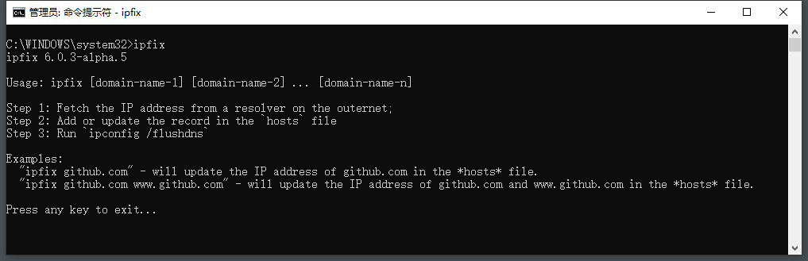
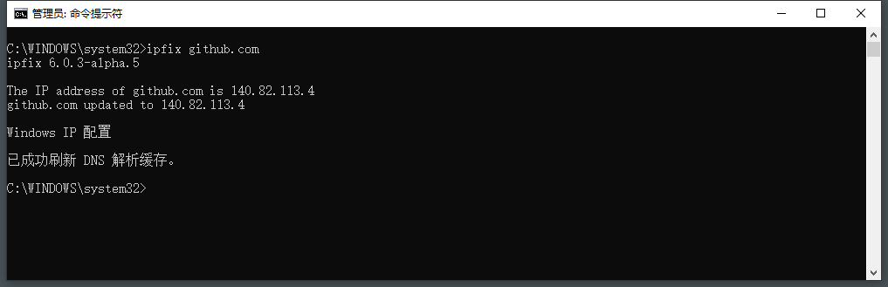
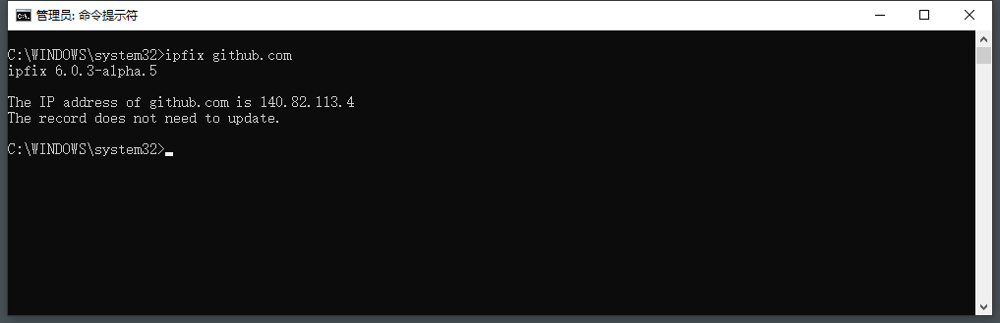

中文 | [English](./README.en.md)

# ipfix
一个工具(控制台程序)：指定一个域名，程序将从外网获取IP地址，更新本机hosts文件，并刷新DNS缓存。

## 程序流程
- 第1步：查询IP地址;
- 第2步：将记录写入`hosts`文件;
- 第3步：刷新DNS缓存。

## IP地址查询方法
本程序从*https://ipaddress.com*上查询IP地址。

* 正在考虑：是否改为从某一固定（根）域名服务器进行查询。
* 未来某天也许可以考虑：是否改为从多个（根）域名服务器中选取较快速的服务器进行查询，这些服务器可由社区投票决策。

## 应用场景
- 国内直接`ping`到的IP地址经常无法正常访问国外网站，原因是`域名被劫持`，此时，您可能需要本程序。
- 通过本程序，您可以一次查询更新多个域名。
- 结合Windows任务计划程序，您可以定时执行查询更新。

## 不适用
本程序不适用于`IP地址被墙`造成的访问困难。

## 用法演示

* 上图中执行`ipfix`：由于未带参数，所以显示帮助信息。

---


* 上图中执行`ipfix github.com`：将在`hosts`文件中更新(若无则新增)一条记录，如下：  
*C:\Windows\system32\drivers\etc\hosts*
```
140.82.113.4 github.com
```
---


* 上图中执行`ipfix github.com`：由于此时`hosts`文件中的记录与本次查询的相同，因此无须对文件进行操作，亦不必刷新DNS缓存。

_注意：这个IP地址只是一个示例，事实上github.com的IP地址很频繁地在几个地址之间反复左右横跳，也正因为如此才有本程序存在的价值。_

---


* 上图中执行`ipfix`：由于当前窗口不是管理员模式，所以程序自动开新窗口运行在管理员模式。
* 由于`hosts·文件写入须提权，因此本程序须运行在管理员模式。
* 若当前窗口不是管理员模式，则程序自动开新窗口运行在管理员模式，执行完成后自动关闭窗口。此时，您很可能看不到执行结果，除非(1)没有带参数，或(2)没有查到IP地址，或(3)程序执行过程中发生异常。这样设计的主体思想是：发号施令者（就是您啦）发出指令后，直接看结果（能不能用，好不好用），除非结果不好才有调查研究的必要。

## 定时任务
您也可以使用`Windows``任务计划程序`配置定时执行的任务（建议每小时，或由某事件触发）。配置操作请参考：[如何配置Windows任务计划](https://community.spiceworks.com/how_to/17736-run-powershell-scripts-from-task-scheduler)。  
以下是示例：
- General
    - Name: myvas-fix-github-ipaddress
    - Description: Timed updating the hosts record of github.com
- Triggers
    - Every 1 hour(s)
- Actions
    - Start a program
    - Program/Script: `ipfix.exe`
    - Argument: `github.com www.github.com`
