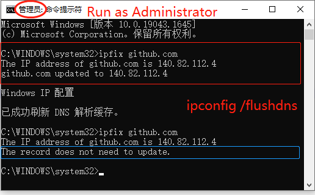

中文 | [English](./README.en.md)

# ipfix
一个工具(控制台程序)：指定一个域名，程序将从外网获取IP地址，更新本机hosts文件，并刷新DNS缓存。

- 工作原理：本程序从*https://ipaddress.com*上查询IP地址。
- 应用1：国内直接`ping`到的IP地址经常无法正常访问国外网站，原因是`域名被劫持`，此时，您可能需要本程序。
- 应用2：通过本程序，您可以一次查询更新多个域名。
- 应用3：结合Windows任务计划程序，您可以定时执行查询更新。
- 不适用：本程序不适用于`IP地址被墙`造成的访问困难。


## 演示


- `ipfix github.com`：将在hosts文件中更新(若无则新增)一条记录，如下：  
*C:\Windows\system32\drivers\etc\hosts*
```
140.82.114.4 github.com
```
注意：这个IP地址只是一个示例，事实上github.com的IP地址很频繁地在几个地址之间反复左右横跳。


## 程序流程
- 第1步: 从外网查询IP地址;
- 第2步：将记录写入*hosts*文件;
- 第3步：刷新DNS缓存。


## 定时任务
使用`Windows``任务计划程序`进行配置。[参考链接](https://community.spiceworks.com/how_to/17736-run-powershell-scripts-from-task-scheduler)
- General
    - Name: myvas-fix-github-ipaddress
    - Description: Timed updating the hosts record of github.com
- Triggers
    - Every N minutes
- Actions
    - Start a program
    - Program/Script: `ipfix.exe`
    - Argument: `github.com www.github.com`
