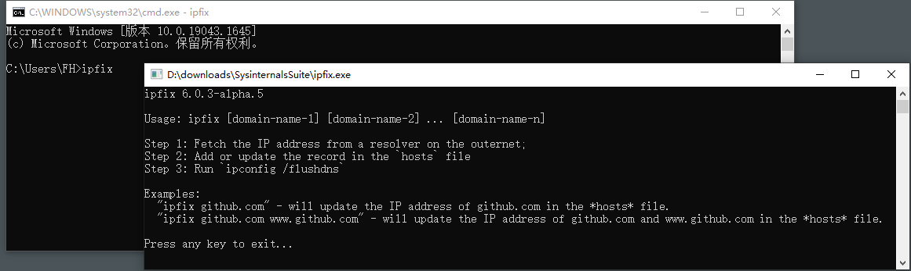

中文 | [English](./README.en.md)

# ipfix
一个工具(控制台程序)：指定一个域名，程序将从外网获取IP地址，更新本机hosts文件，并刷新DNS缓存。

## 程序流程
- 第1步：查询IP地址;
- 第2步：将记录写入`hosts`文件;
- 第3步：刷新DNS缓存。

## IP地址查询方法
1. 从DNS服务提供商查询IP地址。

    [Best free & Public DNS Servers](https://www.lifewire.com/free-and-public-dns-servers-2626062)
    
    |Provider|Primary DNS|Secondary DNS|
    |-|-|-|
    |Google|	8.8.8.8|	8.8.4.4|
    |Control D|	76.76.2.0|	76.76.10.0|
    |Quad9|	9.9.9.9|	149.112.112.112|
    |OpenDNS Home|	208.67.222.222|	208.67.220.220|
    |Cloudflare|	1.1.1.1|	1.0.0.1|
    |CleanBrowsing|	185.228.168.9|	185.228.169.9|
    |Alternate DNS|	76.76.19.19|	76.223.122.150|
    |AdGuard DNS|	94.140.14.14| 94.140.15.15|
    
    注意：本程序依次尝试主DNS服务器查询，若失败则换下一个服务提供商。

2. 从[ipaddress.com](https://ipaddress.com/website/github.com)上查询IP地址。

3. 从[nslookup.io](https://www.nslookup.io/domains/github.com/dns-records/#usa)上查询IP地址。

## 应用场景
- 国内直接`ping`到的IP地址经常无法正常访问国外网站，原因是`域名被劫持`，此时，您可能需要本程序。
- 通过本程序，您可以一次查询更新多个域名。
- 结合Windows任务计划程序，您可以定时执行查询更新。

## 不适用
本程序不适用于`IP地址被墙`造成的访问困难。

## 用法演示
<pre style="background-color:black;color:white;">
C:\>ipfix
ipfix 6.0.4

Usage: ipfix [Option] [domain-name-1] [domain-name-2] ... [domain-name-n]

[Option]
  -q|--quiet    Run in quiet mode.

Description:
Step 1: Fetch the IP address from a resolver on the outernet;
Step 2: Add or update the record in the `hosts` file
Step 3: Run `ipconfig /flushdns`

Examples:
  "ipfix github.com" - will update the IP address of github.com in the `hosts` file.
  "ipfix github.com www.github.com" - will update the IP address of github.com and www.github.com in the `hosts` file.

Press any key to exit...
</pre>
上图中执行`ipfix`：由于未带参数，所以显示帮助信息。

---
<pre style="background-color:black;color:white;">
C:\>ipfix github.com
ipfix 6.0.4

The IP address of github.com is 140.82.112.3
github.com updated to 140.82.112.3

Windows IP Configuration

Successfully flushed the DNS Resolver Cache.

Press any key to exit...
</pre>
上图中执行`ipfix github.com`：将在`hosts`文件中更新(若无则新增)一条记录：  
*C:\Windows\system32\drivers\etc\hosts*
```
140.82.112.3 github.com
```

---
<pre style="background-color:black;color:white;">
C:\>ipfix github.com
ipfix 6.0.4

The IP address of github.com is 140.82.112.3
The record does not need to update.

Press any key to exit...
</pre>
上图中执行`ipfix github.com`：由于此时`hosts`文件中的记录与本次查询的相同，因此无须对文件进行操作，亦不必刷新DNS缓存。

_注意：这个IP地址只是一个示例，事实上github.com的IP地址很频繁地在几个地址之间反复左右横跳，也正因为如此才有本程序存在的价值。_

---


上图中执行`ipfix`：由于当前窗口不是管理员模式，所以程序自动开新窗口运行在管理员模式。
* 由于`hosts`文件写入须提权，因此本程序须运行在管理员模式。
* 若当前窗口不是管理员模式，则程序自动开新窗口运行在管理员模式，执行完成后等待按下任意键退出。
* 若在命令中带上`-q`或`--quiet`参数，则将自动关闭窗口，此时，您很可能看不到执行结果，除非(1)没有带参数，或(2)没有查到IP地址，或(3)程序执行过程中发生异常。此类场景的主体思想是：发号施令者（就是您啦）发出指令后，直接看结果（能不能用，好不好用），除非结果不好才有调查研究的必要。

---
<pre style="background-color:black;color:white;">
C:\>ipfix notepad-plus-plus.org github.global.ssl.fastly.net cdnjs.cloudflare.com
ipfix 6.0.4

The IP address of notepad-plus-plus.org is 172.67.213.166
The record does not need to update.
The IP address of github.global.ssl.fastly.net is 199.232.69.194
The record does not need to update.
The IP address of cdnjs.cloudflare.com is 104.17.24.14
The record does not need to update.

Press any key to exit...
</pre>
上图中执行`ipfix notepad-plus-plus.org github.global.ssl.fastly.net cdnjs.cloudflare.com`：本程序将依次查询这些域名的IP地址并更新。

## 定时任务
您也可以使用Windows`任务计划程序`配置定时执行的任务（建议每小时，或由某事件触发）。配置操作请参考：[如何配置Windows任务计划](https://community.spiceworks.com/how_to/17736-run-powershell-scripts-from-task-scheduler)。  

以下是示例：
- General
    - Name: myvas-fix-github-ipaddress
    - Description: Timed updating the hosts record of github.com
- Triggers
    - Every 1 hour(s)
- Actions
    - Start a program
    - Program/Script: `ipfix.exe`
    - Argument: `github.com www.github.com`

## 问题反馈
* 欢迎[新开Issue](https://github.com/myvas/ipfix/issues)报告故障、提出建议或意见。
* 欢迎[Fork](https://github.com/myvas/ipfix/fork)及PR (Pull Requests)奉献您的劳动成果^_^
